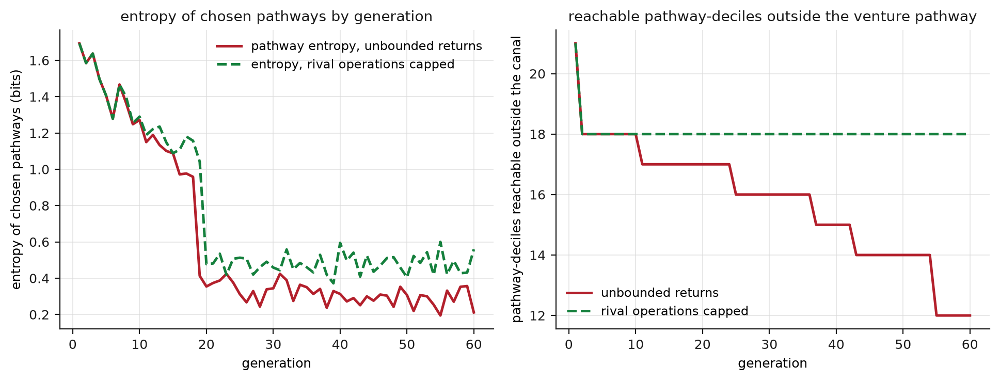
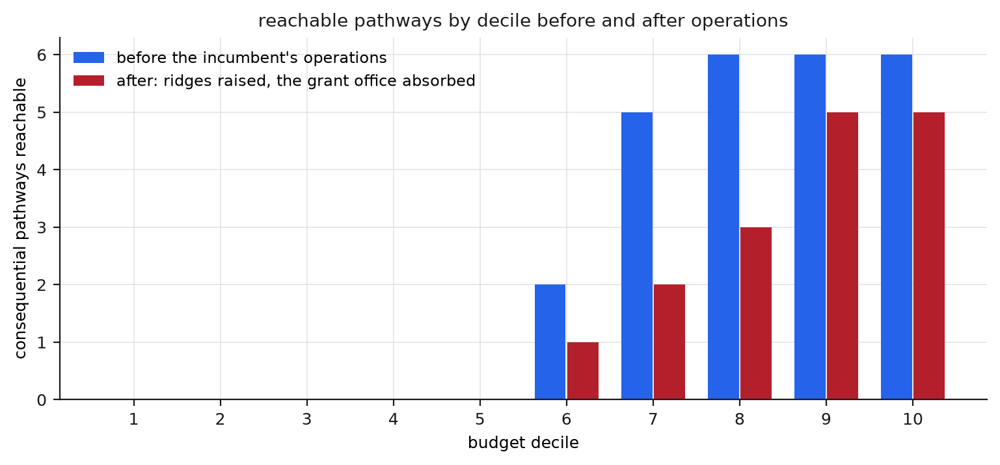

## Abstract

Theories of freedom based on non-interference, resources or substantive opportunity do not capture the fact that institutions construct the paths by which intentions become consequential action, and that these paths, with their costs, risks and gatekeepers, are objects of power. We define freedom as reachability, the set of consequential states an agent can attain from its position through existing institutional pathways within its budget of money, time, risk and permission and compute it in a simulation. In a landscape of 6 pathways permitted to every agent, with a cheap consumption state reachable by all, the top budget decile reaches 6 pathways and the bottom five reach none, and the pathway modelled on open foundational infrastructure is reachable by 3 deciles of 10. When returns feed back on the landscape, the one appropriable pathway deepens and its alternatives silt: over 60 generations the entropy of chosen pathways falls from 1.69 bits to 0.21 with no change in law. Capping what returns may do to rival pathways preserves their reachability (18 pathway-deciles against 12) while the dominant pathway's share still concentrates. An incumbent spending returns on raising rivals' costs and capturing a grant office shrinks the reachable sets of 5 deciles while every consumer price stays fixed. Shared substrates raise reach from 19 to 49 pathway-deciles (open) or 45 (enclosed); after the steward fails, the open substrate retains all of its reach and the enclosed platform 0.56, although the platform wins when no one funds maintenance. Insurance against failure raises the number of deciles able to attempt any consequential pathway from 5 to 7.

## Introduction

An engineer wants to build a new foundational network architecture: open, interoperable, resistant to enclosure, likely to generate large social value and no monopoly rent. No law forbids the project and no censor blocks it. In most developed economies, however, the project has almost no institutional home: no standard funding form, no organizational template, no maintenance financing, no procurement route and no way for its builders to earn a living while building. The engineer is free to attempt it in every sense the classical theories of freedom can express, and the attempt fails institutionally before it starts. One pathway, by contrast, is open and well established: prototype, accelerator, venture round, proprietary firm, scale, exit. A project that enters it will not be the project the engineer intended.

A path can be permitted and absent. A person can hold rights, and even resources, in a landscape where nothing consequential is reachable from their position. The structure that determines which paths exist, what they cost and who controls their gates is built, maintained and rebuilt by identifiable institutions, and can therefore be contested and owned. We define freedom as reachability: the set of consequential states an agent can attain from its position through existing pathways within its budget of money, time, risk and permission. The account requires three things: a concept that distinguishes reachability from earlier accounts, a theory of power that operates on landscapes, and a criterion for comparing landscapes. We provide them together with a model in which each object is computed.

## Freedom as reachability

Negative liberty asks whether anyone interferes (Berlin, 1969), and nobody interferes with the engineer. Resource accounts ask what a person holds, but the same holdings buy different lives in different institutional environments. The capability approach comes closest: Sen relocated freedom from holdings to substantive opportunity, what people are actually able to do and be (Sen, 1999). Reachability is a capability concept made dynamic and institutional through three additions.

First, opportunity is shaped by paths. Between an agent and a consequential state lies a sequence of transitions, each with a cost, a risk, a duration and sometimes a gatekeeper, and the feasibility of the destination is a property of the whole sequence. A state can be unreachable although every individual step is permitted, if the steps do not exist as a fundable and survivable series. Gibson's affordances describe the analogous relation between an organism and its surfaces, what an environment offers an agent relative to what that agent is (Gibson, 1979). Reachability applies the idea to institutions, whose surfaces are legal forms, funding instruments and standards, over periods of years.

Second, consequential states are mostly reached collectively. No individual builds a network, a university or a scientific discipline alone, and the reachable set of an isolated person contains little of consequence. Access to organization is therefore a component of freedom, and a landscape that starves every organizational form except one restricts freedom even if each person's individual options are unchanged.

Third, a path that depends on discretion differs from a path available by right. A pathway passable only when an office consents places the traveller under the office's arbitrary power, which is Pettit's definition of domination, and remains domination when the office is benevolent and always consents (Pettit, 1999). The model therefore records the two kinds of reach separately.

## Institutional landscapes

Waddington depicted development as a ball rolling through a landscape of valleys whose shape, produced by underlying interactions, makes some trajectories easy, some hard and some effectively impossible; canalization is his term for the deepening of a valley until development returns to it despite perturbation (Waddington, 1942; Waddington, 1957). The figure transfers to institutions as a structural description. The landscape is the transition system produced by property and corporate law, finance, intellectual-property rules, procurement, standards, credentialing, social insurance and infrastructure; a valley is a viable organizational trajectory; a ridge is a barrier of cost, law or legibility; and an attractor is a stable form toward which projects converge.

One difference from the biological case matters for the politics. Social landscapes are reflexive: agents developing within them can discover their shape, contest it and rebuild it, and the most successful acquire the means to reshape the terrain behind them. Institutions do not determine conduct mechanically; they differentially weight the cost, risk, intelligibility and expected viability of strategies, and the landscape figure needs a mechanism for this. Arthur supplied one: under increasing returns, early advantage compounds and an institutional form can become locked in against alternatives that would have served at least as well (Arthur, 1989). Canalization is path dependence described topographically.

Law underlies the whole landscape. Pistor's account of capital describes landscape construction: assets become capital when coded in legal modules conferring priority, durability, universality and convertibility, and the legal profession decides which projects acquire that protection (Pistor, 2019). Polanyi's argument that the market order is itself an institutional construction, established and maintained, implies that there was never a natural state for regulation to disturb (Polanyi, 1944). There is no landscape-free baseline, so the question is who shapes the terrain and toward what ends.

## Open infrastructure and the venture pathway

The Internet shows that the dominant pathway is one design among several, because the foundational layer of the present economy was built almost entirely outside it. Packet internetworking was published as an open protocol by researchers on public contracts (Cerf and Kahn, 1974). The network grew through defence agencies, national science foundations, universities and an open standards process in which anyone could submit a draft; the participants' own history records public funding and institutional plurality (Leiner et al., 2009). The Web was written at a physics laboratory, and on 30 April 1993 CERN placed the software in the public domain (European Organization for Nuclear Research, 1993). The resulting architecture did not convert the value it created into a claim on everything built above it. The protocols became a substrate on which Google, Wikipedia, a million firms and several billion people built, which is why the inventors of TCP/IP and the Web are not the richest people in history, a fact that describes their institutional landscape.

The history was not pure. Military funding, contractors, telephone monopolies and later platform capital were present throughout, and the point stands: a plural landscape with an open foundational layer produced infrastructure that no venture pathway would have built. The venture form selects for appropriability, rapid scale, defensibility, concentrated ownership and an exit within the fund's horizon. A project can fail each of these tests and still be what a society needs: open by design, slow to mature, free of rent and generative of value it cannot capture. The judgment that such a project would make a poor company is compatible with the judgment that it would make excellent infrastructure, and a landscape whose only deep valley is the venture pathway will not build its own foundations. The claim is comparative, and the model below produces it without any actor breaking a law.

## Model design

The model builds the landscape explicitly. Six pathways run from a common start to consequential terminals: a venture pathway, cheap to enter and appropriable at the end; a discretionary grant pathway; a commons pathway; a cooperative pathway; a public-agency pathway behind an office; and open foundational infrastructure, long, unsubsidized and unowned at the end. A consumption state beside them is cheap and inconsequential, so a theory that counts options finds no problem. Each pathway is a sequence of stage costs with a failure risk, and two carry permission gates. Agents differ only in budget, arranged in 10 deciles from 1.0 to 40.0, and an uninsured agent must hold a ruin reserve of 2.0 against failure before attempting anything. Every pathway is legally open to every agent in every experiment. The numbers are properties of the model's geometry and make no empirical claim.

There are four experiments. The first computes reachable sets by decile. The second runs 60 generations in which agents choose affordable pathways by expected value and the returns of the appropriable terminal reshape the landscape, deepening the venture pathway and, unless capped, raising the costs of its rivals. The third gives an incumbent a budget of landscape operations while holding every price fixed. The fourth builds three worlds, with no shared substrate, an open protocol and an enclosed platform, and then removes their stewards.

{width=100%}

## Reachable sets and endogenous narrowing

Permission is uniform while reachability rises in steps. The top decile reaches all 6 pathways, 4 directly and 2 through an office's discretion. The bottom 5 deciles reach no consequential pathway, while the consumption state remains reachable by everyone. This configuration, with no interference, universal permission and options everywhere, leaves half the population unable to reach any consequential state, and the classical theories cannot register it. The open-infrastructure pathway, permitted to all, is reachable by deciles 8 to 10. The engineer of the introduction corresponds to decile 7, able to reach the venture, commons and cooperative pathways but not the one pathway suited to the project, which exists in law only.

In the second experiment the landscape changes. Returns from the venture terminal deepen that pathway and silt the alternatives, and over 60 generations the entropy of chosen pathways falls from 1.69 bits to 0.21 while the venture share of attempts rises from 0.59 to 0.97, with no statute altered and no gate closed. Two qualifications apply. The venture pathway becomes more accessible as it deepens, admitting a fifth decile that could not afford it at the start, so the narrowing is experienced as expanding opportunity. And the concentration requires no malice: it follows from increasing returns operating on the terrain.

The cap experiment separates two quantities that are often confused. Limiting what returns may do to rival pathways, while leaving improvement of one's own pathway unlimited, does not prevent the venture pathway from dominating traffic; its share still exceeds 0.9 because it keeps improving. The cap preserves the reachability of the alternatives: at generation 60, 18 pathway-deciles outside the venture pathway remain reachable under the cap, against 12 without it, and the uncapped landscape is still silting at the end of the run. On the reachability account this is the relevant quantity, since freedom concerns the availability of alternatives to those who want them and not their market share.

{width=100%}

## Landscape power

In the third experiment the incumbent at the end of the venture pathway receives a budget of operations: it raises costs on the commons, cooperative and infrastructure pathways and captures the grant office, whose gate now opens at the incumbent's discretion. Every consumer price is identical before and after. The reachable sets of 5 deciles shrink, with the largest losses in deciles 6 to 8, while the top decile loses one pathway and keeps five. An antitrust doctrine that measures consumer prices finds no harm. An option-space doctrine finds it directly: the damage from concentrated private power consists of deleted futures, reductions of the adjacent possible (Kauffman, 2000), and it does not appear in prices.

This kind of power has been described in several traditions. Strange called structural power the capacity to shape the frameworks within which others must operate (Strange, 1988), and Deleuze described control as modulation of the medium in which action occurs (Deleuze, 1992). Landscape power is the dynamic, topological form of the same object: the capacity to alter the transition structure through which other agents pursue consequential action, by creating, deleting, repricing, gating or freezing pathways. It is power over the conditions of other people's agency, and it is the appropriate register for the question of extreme wealth. Winters and Page showed that oligarchy is a matter of concentrated material power and coexists with elections (Winters and Page, 2009; Winters, 2011); Anderson showed that liberal societies constrain arbitrary authority everywhere except inside institutions they classify as private (Anderson, 2017); Rawls conceded that political liberties lose their fair value under sufficient economic inequality (Rawls, 1993); and Robeyns argued that extreme wealth is objectionable on democratic grounds independent of desert (Robeyns, 2019).

Reachability combines these into one question. Wealth at the scale of the largest fortunes converts into landscape operations through standards, infrastructure, media, lobbying and law, and the constitutional question is how large a change in other people's reachable sets one person may produce unilaterally. Societies already answer this question for officers of the formal constitution: presidents, generals, judges and reactor operators act within systems of authorization because their reach is consequential. Cross-domain private reach is left largely unregulated because it is classified as property. The principle implemented by the model's cap is bounded landscape power: unlimited improvement of one's own pathway, constrained operations on other people's pathways, and no actor able to freeze the terrain. The principle does not depend on the character of any operator.

{width=100%}

## Shared substrates

The fourth experiment examines shared foundations. In the flat world nothing is shared and each pathway bears the full cost of its infrastructure; the substrate worlds add 4 downstream pathways built on a foundation that is open in one variant and tolled and gated by a platform in the other. Reach in the flat world is 19 pathway-deciles; the open substrate raises it to 49 and the enclosed one to 45. Both substrates canalize, with at least 0.9 of attempts routed through substrate-based pathways (0.97 in the open world and 0.90 in the enclosed one), so TCP/IP is also a canal, and canalization as such does not constitute domination. Zittrain's criterion distinguishes them: a generative substrate lets audiences its designers never anticipated build things its designers never imagined (Zittrain, 2006). The two substrates differ in one property, whether anyone may build on the foundation without permission, and the steward-failure experiment measures its effect. When the steward fails, the open world retains all of its reach because the downstream pathways can be forked and survive their origin, while the enclosed world retains 0.56 because the gate fails with its keeper.

One regime favours the platform. Open substrates need maintainers, and maintenance is a commons problem. On a grid of public maintenance levels, the open substrate silts at low funding: at zero funding the enclosed platform reaches 45 pathway-deciles against 41 for the open substrate, the two tie at intermediate levels, and the open substrate wins only at full funding. The gatekeeper funds maintenance from its tolls, so a polity that wants open foundations without funding stewardship has in effect chosen the platform. Ostrom showed that stewardship without an owner is an institutional craft with known working designs (Ostrom, 1990; Ostrom, 2010), and Mazzucato documented that the deepest substrates of the present economy were built by public risk-taking (Mazzucato, 2013).

{width=100%}

## Insurance against failure

The final result concerns the bottom of the distribution. An uninsured agent must reserve against ruin before attempting anything, so ruin risk acts as a surcharge on every consequential pathway and excludes poorer agents from attempts that richer agents make routinely. Insurance against the failure of an attempt raises the number of deciles able to attempt any consequential pathway from 5 to 7. Social provision, on this reading, is risk-bearing infrastructure that changes which trajectories exist for whom, in addition to compensating after market outcomes. A person two missed paychecks from homelessness cannot spend 2 years building an open protocol, whatever their formal permissions.

The same insurance in the flat world raises the number from 4 deciles to 5, because there is little to attempt; insurance against failure is worth what the reachable pathways make it worth. A welfare policy that funds security without building pathways, and an innovation policy that builds pathways reachable only from the top deciles, each implement half of one policy.

## Design principles

The design principles follow from the model's operations, and each has existing instruments. Lower the entry ridges, through insurance against failure and universal services. Create unowned valleys, through funding forms that do not create an owner, such as grants, fellowships, prizes and mission agencies, which remain small relative to the venture pathway. Keep the foundational layer open and let competition occur above it, the rule most strongly supported by the history above and one that European interoperability obligations have begun to legislate (European Union, 2022). Fund stewardship as infrastructure, since maintenance determines whether open foundations survive. Bound landscape power through structural limits on cross-domain control and on operations against rival pathways, which amounts to antitrust understood as landscape maintenance. And keep the landscape revisable, following Unger's institutional experimentalism, which refuses to treat any arrangement as the necessary form of an ideal (Unger, 1987), and Sabel and Zeitlin's recursive framework of provisional goals, decentralized variation and revision (Sabel and Zeitlin, 2008).

Hayek's argument from dispersed knowledge supports the same conclusion: no planner knows which valleys a society will need (Hayek, 1945). Identifying discovery with one organizational form, the investor-owned firm in a market for control, creates a monoculture of discovery procedures that the argument itself rules out. Taken seriously, the knowledge argument requires plural discovery institutions (markets, commons, mission agencies, cooperatives and the sciences), each canalizing differently and none owning the terrain.

## Objections

One objection is that every institution canalizes. This is correct, and the criterion here is not flatness: a flat landscape coordinates little and reaches little, as the model's flat world shows. The relevant distinctions are between generative and enclosing canalization and between forkable and frozen structures; both substrates canalize, and only one survives the failure of its steward.

A second objection holds that a larger number of options does not amount to greater freedom, and it is also correct. The consumption state is reachable by everyone in every experiment and counts for nothing; reachability is weighted toward consequential states, following Sen's refusal to value formal opportunity as such.

A third objection is that standardization is efficient and that monopoly sometimes is too. The model addresses a narrower question: whether coordination requires an owner with power over rival pathways, and what an arrangement retains when its steward fails or defects. The gatekeeper's advantage in the unmaintained regime is real and is reported above; it is an argument for funding maintenance.

A fourth objection asks who decides which futures matter. The answer is procedural: bound the power that freezes the landscape, fund insurance and substrates, keep forks possible, and leave the catalogue of desirable futures open. On this account a democracy is a polity in which citizens both choose governors within an inherited landscape and share, under contest and within bounds, the power to reshape that landscape.

## Reproducibility

The simulation, its four figures and every model number quoted above regenerate from one command in the repository (`simulation/run_all.py`; agent choice runs on a recorded seed and everything else is expected-value arithmetic). Fourteen invariants fail the run if broken, among them the uniformity of permission against the steps of reach, the endogenous fall in entropy with no change in law, the cap preserving alternatives while the dominant share concentrates, the price-neutral shrinkage of 5 deciles' reachable sets, the canalization of both substrates, the forkable world's survival of its steward, the enclosed platform's win at zero maintenance, and the dependence of insurance on available pathways.

## References

Anderson, E. (2017). *Private Government: How Employers Rule Our Lives (and Why We Don't Talk about It)*. Princeton: Princeton University Press.

Arthur, W. B. (1989). Competing technologies, increasing returns, and lock-in by historical events. *The Economic Journal*, 99(394), 116--131.

Berlin, I. (1969). *Four Essays on Liberty*. Oxford: Oxford University Press.

Cerf, V. G., and Kahn, R. E. (1974). A protocol for packet network intercommunication. *IEEE Transactions on Communications*, 22(5), 637--648.

Deleuze, G. (1992). Postscript on the societies of control. *October*, 59, 3--7.

European Organization for Nuclear Research (1993). *Statement Concerning CERN W3 Software Release into Public Domain*. 30 April 1993. Geneva: CERN Document Server, record 1164399.

European Union (2022). Regulation (EU) 2022/1925 on contestable and fair markets in the digital sector (Digital Markets Act). *Official Journal of the European Union*, L 265.

Gibson, J. J. (1979). *The Ecological Approach to Visual Perception*. Boston: Houghton Mifflin.

Hayek, F. A. (1945). The use of knowledge in society. *The American Economic Review*, 35(4), 519--530.

Kauffman, S. A. (2000). *Investigations*. New York: Oxford University Press.

Leiner, B. M., Cerf, V. G., Clark, D. D., Kahn, R. E., Kleinrock, L., Lynch, D. C., Postel, J., Roberts, L. G., and Wolff, S. (2009). A brief history of the internet. *ACM SIGCOMM Computer Communication Review*, 39(5), 22--31.

Mazzucato, M. (2013). *The Entrepreneurial State: Debunking Public vs. Private Sector Myths*. London: Anthem Press.

Ostrom, E. (1990). *Governing the Commons: The Evolution of Institutions for Collective Action*. Cambridge: Cambridge University Press.

Ostrom, E. (2010). Beyond markets and states: polycentric governance of complex economic systems. *American Economic Review*, 100(3), 641--672.

Pettit, P. (1999). *Republicanism: A Theory of Freedom and Government*. Oxford: Oxford University Press.

Pistor, K. (2019). *The Code of Capital: How the Law Creates Wealth and Inequality*. Princeton: Princeton University Press.

Polanyi, K. (1944). *The Great Transformation: The Political and Economic Origins of Our Time*. New York: Farrar and Rinehart.

Rawls, J. (1993). *Political Liberalism*. New York: Columbia University Press.

Robeyns, I. (2019). What, if anything, is wrong with extreme wealth? *Journal of Human Development and Capabilities*, 20(3), 251--266.

Sabel, C. F., and Zeitlin, J. (2008). Learning from difference: the new architecture of experimentalist governance in the EU. *European Law Journal*, 14(3), 271--327.

Sen, A. (1999). *Development as Freedom*. New York: Alfred A. Knopf.

Strange, S. (1988). *States and Markets*. London: Pinter.

Unger, R. M. (1987). *False Necessity: Anti-Necessitarian Social Theory in the Service of Radical Democracy*. Cambridge: Cambridge University Press.

Waddington, C. H. (1942). Canalization of development and the inheritance of acquired characters. *Nature*, 150(3811), 563--565.

Waddington, C. H. (1957). *The Strategy of the Genes*. London: Allen and Unwin.

Winters, J. A. (2011). *Oligarchy*. Cambridge: Cambridge University Press.

Winters, J. A., and Page, B. I. (2009). Oligarchy in the United States? *Perspectives on Politics*, 7(4), 731--751.

Zittrain, J. L. (2006). The generative internet. *Harvard Law Review*, 119, 1974--2040.
